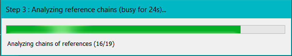

# Unused Assets Finder

_This tool is a Unity editor tool._

Unused Assets Finder is a Unity editor tool used to detect and monitor assets that are not used in your project.

## Usage

In the Unity Editor, in the top menu bar, under the "Tools" tab you'll find the "Unused Assets Finder" option.\
This will open the Unused Assets Finder editor window.

### Popups

When opening the editor window, popups will appear.\
If the tool has already run an analysis on this project, a popup will appear where you can **load the last analysis results** or **start a new analysis**.

If the tool has never analyzed this project or if you choose to start a new analysis, a second popup will appear where you can **start a synchronous analysis** or **start an asynchronous analysis**.

If the tool is not running an analysis or not showing results, the main menu is showing.

### Analysis

The analysis process is the same between the two run modes.\
This tool goes through three separate phases :

1. **Index all assets** added to the project by the user (see limitations in the [support](#Support) section).

2. **Parse asset references** contained in Unity YAML based files (scenes, prefabs, materials, etc...) as well as code and assets references in C# files (see limitations in the [support](#Support) section).

3. **Linking assets references** starting from valid start points (scenes referenced in project settings and asset bundles) to provide valid and invalid references chains.

The analysis process will be interrupted by assembly reloads (given that this will modify the references between assets) and the tool will default back to the main menu.

### Run modes

This tool has two run modes :

- **Synchronous** : the analysis will run at max speed and display progress. You can't use the editor while this is running.

- **Asynchronous** : the analysis will run alongside the Unity Editor application and will try to keep a stable 30 FPS for the Editor application. You can use the editor while this is running.

If you change any code asset or asset references in the project you risk falsifying the analysis results or triggering an assembly reload and thus canceling the process.

### Loading last results

The analysis results are stored in the _PlayerPrefs_ (depends on the platform) and can be loaded instead of starting a new analysis.\
This way of loading will not invalidate any features of this tool.

If an out of date analysis is loaded  and you try to delete an asset that doesn't exist in the form detected by the analysis, the tool will display a warning in the console and abort the removal of that asset.

### Results

When displaying the results, the editor window is split into four regions :

- **The header** displays the same buttons as the main menu to load results or start a new analysis.

- **The selection ribbon** where you can select _referenced assets_, _unreferenced assets_ and _filtering options_.

- **The results body** where you can see a list of assets that you can inspect, preview and select, as well as a search bar and removal/restoration buttons.

- **The footer** where you can select the results page.

#### Asset types

A project can contain many different types of assets.\
The filtering option can help narrow the selection of displayed assets.

Check the [support](#Support) section for the list of supported asset types.

#### Search bar

You can use the search bar to filter assets further by asset name (match whole text).\
This will still apply the asset type and the status filters (referenced / unreferenced).

#### Asset ribbon

This tool displays assets, their name, their type and their path.\
You can also check the assets which depend on this asset through the "Referenced in" dropdown.\
You can preview an asset with the "Preview" button. This will show a preview popup next to the editor window. This popup doesn't need to be closed between assets.\

Not all assets can be previewed.

### Assets removal

Once one of multiple assets are selected, the "Remove assets" button (in red) will appear to the right of the search bar.\
Removing an asset will move it to a hidden folder in the project.

This **hidden folder** is added to the project's .gitignore file if there is one, so that removed files are not shared through git.

Any removed assets with the same name as assets already present in the hidden folder will **overwrite them**, this operation is **not reversible**.

### Assets recovery

If any removed assets are present in the hidden folder, this tool displays a "Restore assets" button (in yellow) to the right of the search bar.\
Restoring assets will move them back into the project folder, in their respective pre-removal path. Any missing folder will be regenerated.\
The hidden folder is then cleared.

## Support

This tool supports all file types natively supported by the Unity Engine. You can find the [full list here](https://docs.unity3d.com/Manual/BuiltInImporters.html).

Several additional file formats are supported :
- **TextMeshPro** file formats (.fontsettings).
- **Shadergraph** file formats (.shadergraph, .subshadergraph).

This tool also has partial support for **C# class** declarations (including keyword _partial_) and references as well as _Resources.Load_ calls with plain text paths.\
There is **no support for scopes or namespaces** in C# scripts.

This tool does not support code references :
- In shader code.
- To custom or built-in packages.
- To plugins.
- Assets marked as "addressable" through the Adressables unity package.

Any variable named after a type of which it is not will be counted as a reference to said type.

All unsupported text file types are considered in the "Text" category.\
All other unsupported file types are considered in the "None" category.

## Known issues

### The editor window is unresponsive and/or the filtering option is empty.

#### Something likely went wrong during an assembly reload with the generation of the "selection dictionaries". **You need to close the window and re-open it**.

### I'm getting null references in the console and part of the editor window is not generated.

#### Something likely went wrong with the GUIStyles needed to display the window. **You need to close the window and re-open it**.

### One of my C# class is counted as referenced but it's another class with the same name which is supposed to be considered.

#### This tool does not support scopes for C# classes, therefore classes with the same names in different scopes (part of namespaces or sub-classes) will be detected as a single class by the tool.

### My editor scripts (including this one) are counted as _unreferenced_.

#### Editor scripts (scripts which use the "UnityEditor" library) are detected as _editor scripts_ and are not referenced by any assets present in a build, except for custom editors which will be detected as referenced by the class they are linked to.